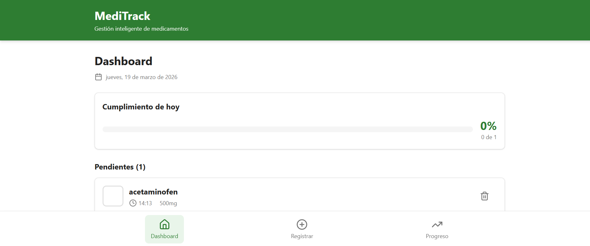
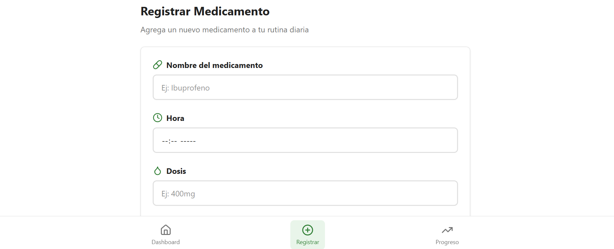
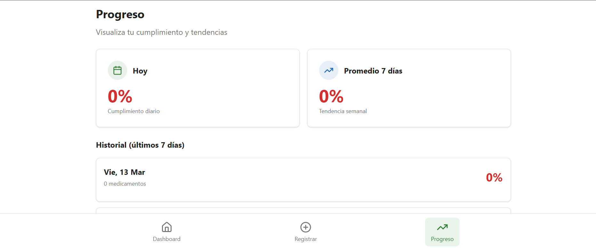
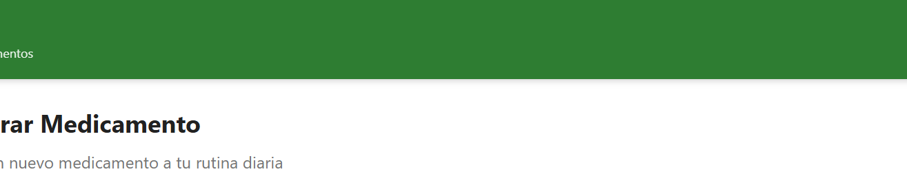
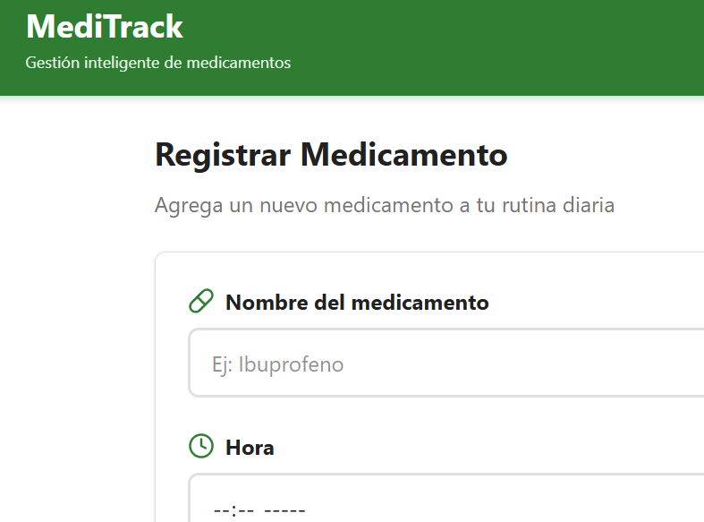
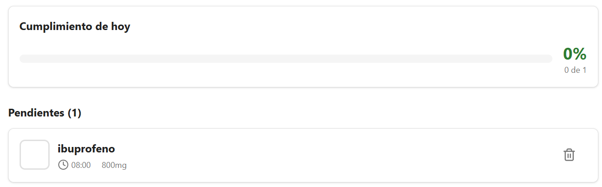
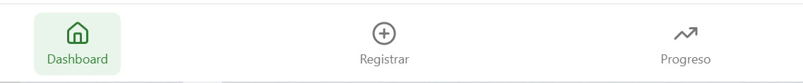
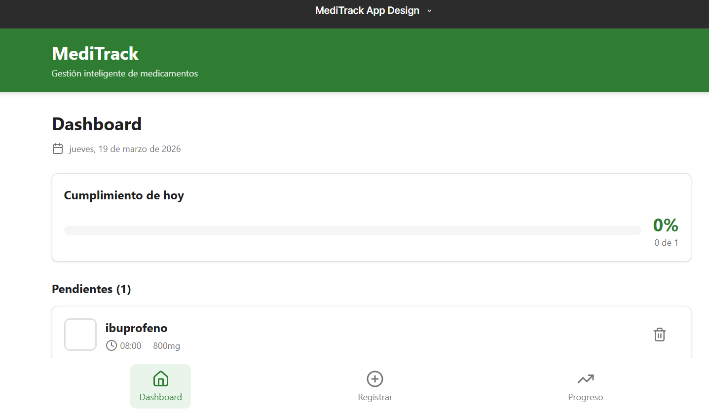
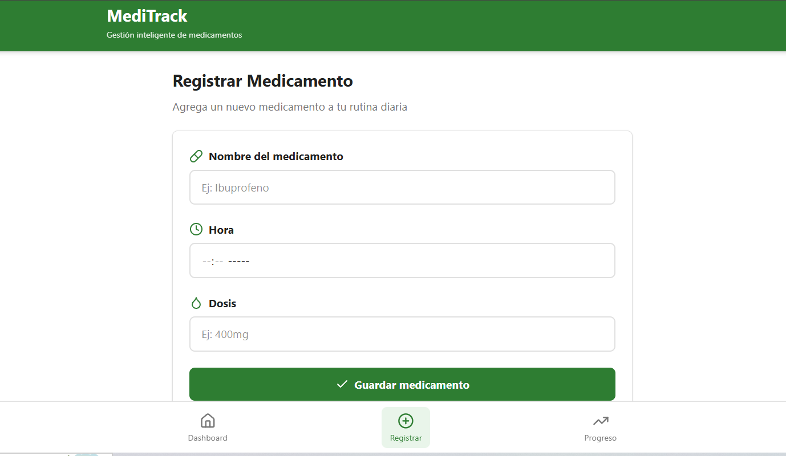
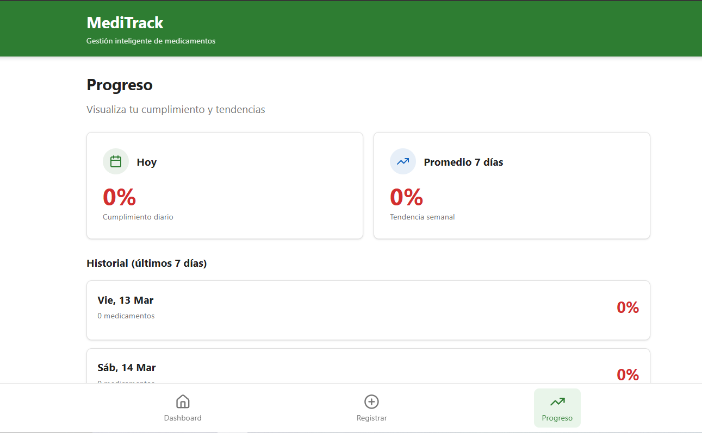

MediTrack — Gestión inteligente de medicamentos
Descripción de la aplicación

MediTrack es una aplicación móvil enfocada en la gestión de medicamentos para adultos entre 40 y 70 años que requieren llevar un control diario de múltiples dosis. La aplicación busca reducir errores en la toma de medicamentos y mejorar la adherencia a tratamientos médicos mediante recordatorios visuales, seguimiento de progreso y registro simplificado.

El problema principal que aborda la aplicación es la dificultad que tienen los usuarios para recordar horarios, dosis y cumplimiento de sus medicamentos, lo cual puede afectar directamente su salud. MediTrack propone una solución simple, accesible y visualmente clara para facilitar este proceso.

Flujo de usuario

El flujo principal consta de tres pantallas interconectadas:

Pantalla 1: Dashboard
Permite visualizar los medicamentos del día, su estado (pendiente o tomado) y acceder al registro de nuevos medicamentos.

Pantalla 2: Registro de medicamento
Contiene un formulario donde el usuario ingresa nombre, hora y dosis del medicamento.

Pantalla 3: Progreso diario
Muestra el porcentaje de cumplimiento y el estado general del tratamiento.

Capturas de Pantallas

Dashboard

Registro de medicamento

Progreso

Design System

El diseño se basa en un sistema de diseño propio que garantiza consistencia visual y reutilización de componentes.

Colores

Primary: #2E7D32

Secondary: #1565C0

Background: #FFFFFF

Surface: #F5F5F5

Text Primary: #212121

Text Secondary: #757575

Tipografía

Heading: 24px Bold

Body: 16px Regular

Caption: 12px Regular

Espaciado

xs: 4

sm: 8

md: 16

lg: 24

Captura del Design System

##Tokens##

##Componentes##

##Recomendada##

Accesibilidad (WCAG 2.1 AA)

Se verificaron los siguientes criterios:

Contraste texto principal sobre fondo: 7.2:1 

Contraste texto secundario: 4.6:1 

Tamaño mínimo de botones: 44x44 px 

Uso de etiquetas accesibles en elementos interactivos

Ejemplos:

Botón guardar: "Guardar medicamento"

Icono editar: "Editar medicamento"

Microinteracciones
1. Guardar medicamento

Trigger: El usuario presiona el botón "Guardar"

Rules: Se valida el formulario y se envían los datos

Feedback: Animación de carga seguida de confirmación visual

Loop: En caso de error, se muestra un mensaje en pantalla

2. Marcar como tomado

Trigger: Tap en estado del medicamento

Rules: Cambia el estado a completado

Feedback: Cambio de color y animación

Loop: Puede revertirse

Especificaciones (Handoff)

Botón primario:

Altura: 48px

Padding: 16px

Color: Primary (#2E7D32)

Border-radius: 8px

Tipografía: 16px Bold

Enlace Figma

https://www.figma.com/make/D5kkUzA0VfISPDkCQahA6r/MediTrack-App-Design?p=f&t=biz0Rjov3w5Gn65r-0&fullscreen=1

Ver diseño en Figma

Referencias

WCAG 2.1 (W3C, 2018)

Material Design Guidelines (Google, 2023)
